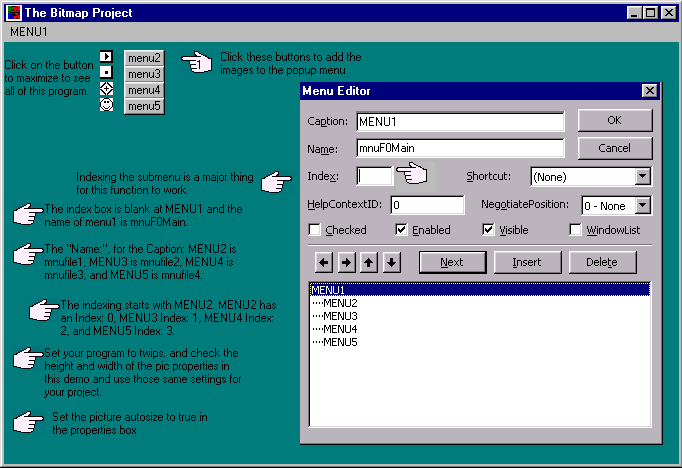



## Adding Bitmaps in Popup Menus

### Description

This project Adds Bitmaps to a Popup menu.

this is a demo project of how to add bitmaps to a popup menu! it's a simple project and easy to understand, cause thats the way i can understand it
 
### More Info
 
this is a demo project of how to add bitmaps to a popup menu! it's a simple project and easy to understand, cause thats the way i can understand it

             |
---                |---
**Submitted On**   |2001-03-19 22:30:36
**By**             |[Jim Byrnes](https://github.com/Planet-Source-Code/PSCIndex/blob/master/ByAuthor/jim-byrnes.md)
**Level**          |Beginner
**User Rating**    |4.2 (25 globes from 6 users)
**Compatibility**  |VB 6\.0
**Category**       |[Custom Controls/ Forms/  Menus](https://github.com/Planet-Source-Code/PSCIndex/blob/master/ByCategory/custom-controls-forms-menus__1-4.md)
**World**          |[Visual Basic](https://github.com/Planet-Source-Code/PSCIndex/blob/master/ByWorld/visual-basic.md)
**Archive File**   |[CODE\_UPLOAD173313192001\.zip](https://github.com/Planet-Source-Code/jim-byrnes-adding-bitmaps-in-popup-menus__1-21800/archive/master.zip)

